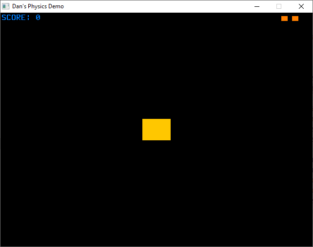
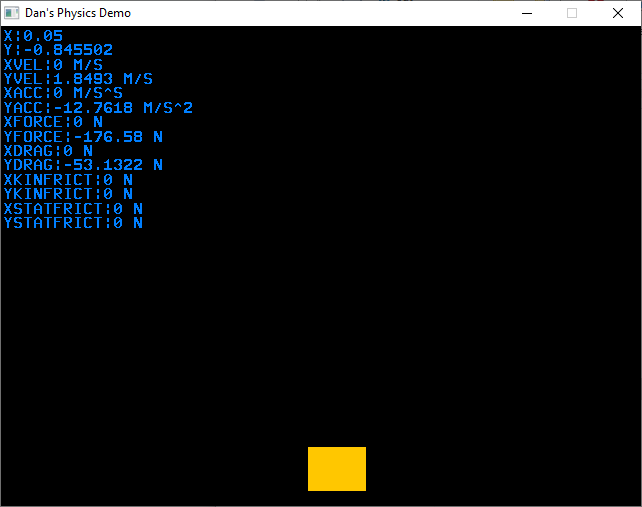
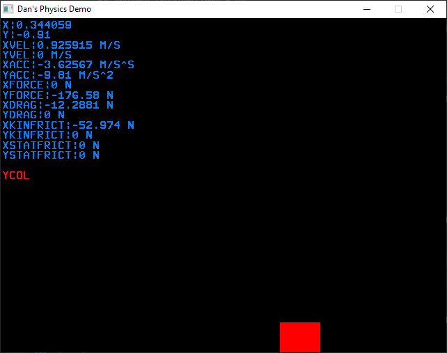

### What is this?
"HelicopterGame" is essentially Flappy Bird before Flappy Bird was a thing.. missed opportunities. I wrote this as a final project in my high school physics class to demonstrate what I learned.

It has basic collision detection with the bottom of the screen, gravity, and allows you to move the color rectangle using the keyboard (which applies forces and updates the physics HUD).

### What is Font.cpp
A meticulously hand-coded bitmap font that I drew in MS Paint and transcoded into hex pixel-by-pixel because I wasn't smart enough to know how to load font files at the time. Impressively stupid.

### Screenshots

